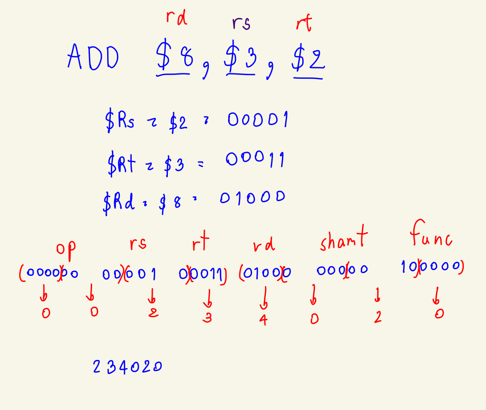
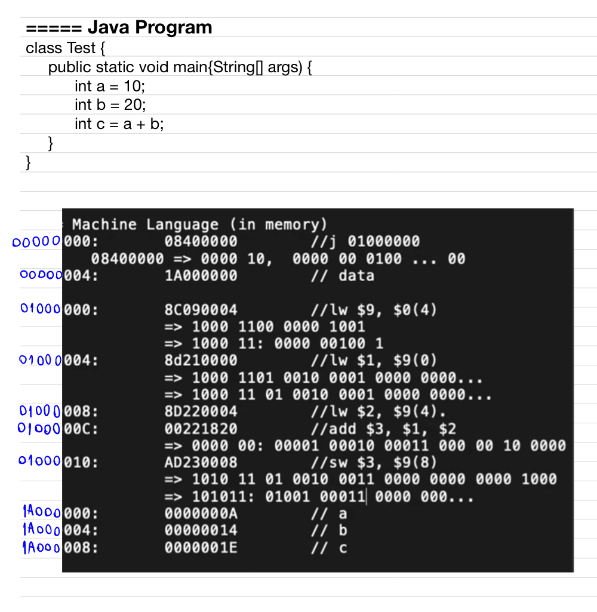
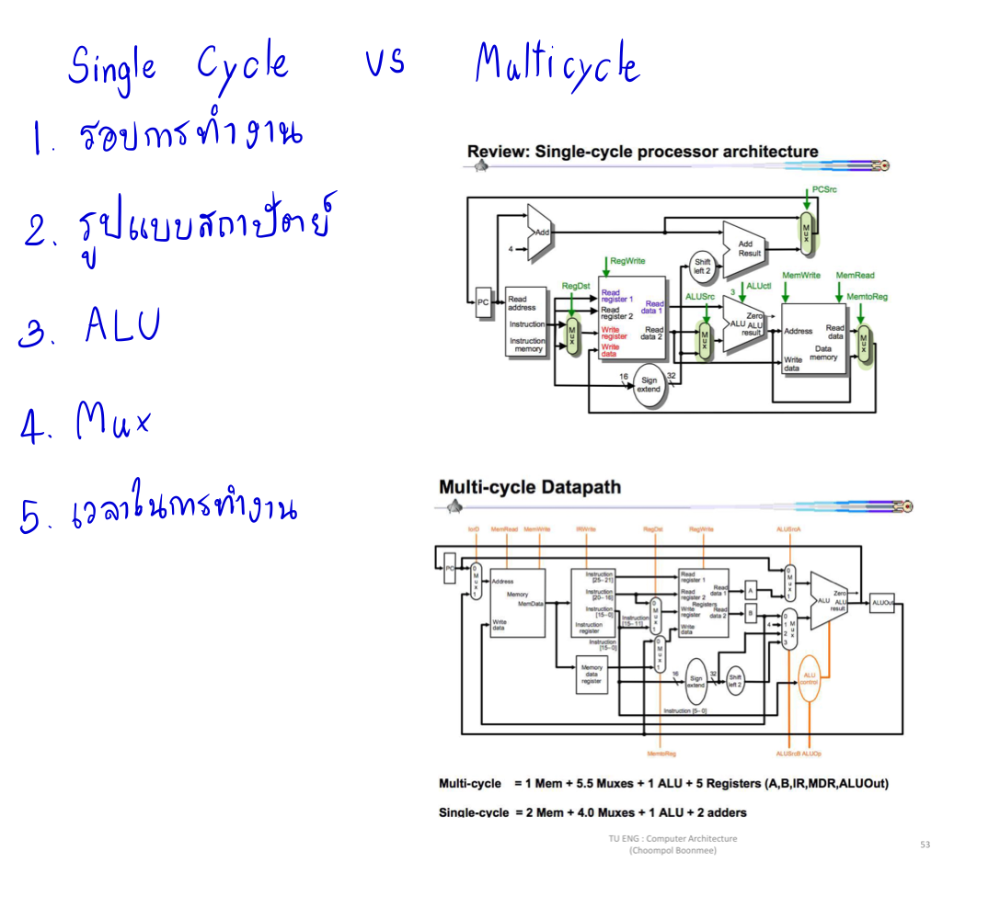
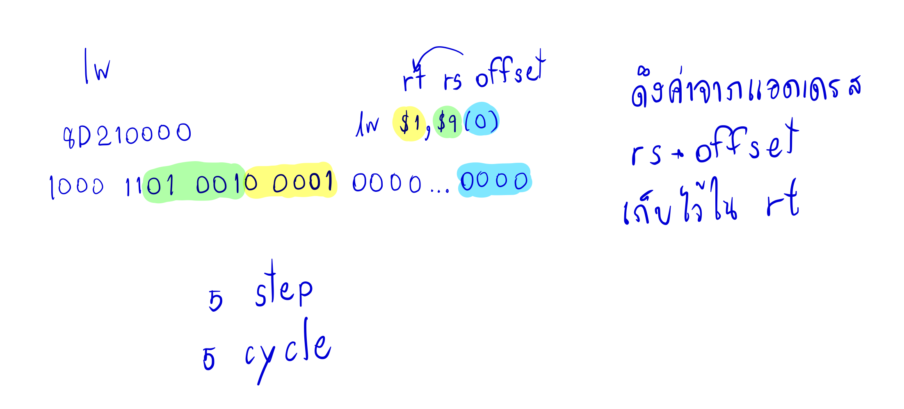
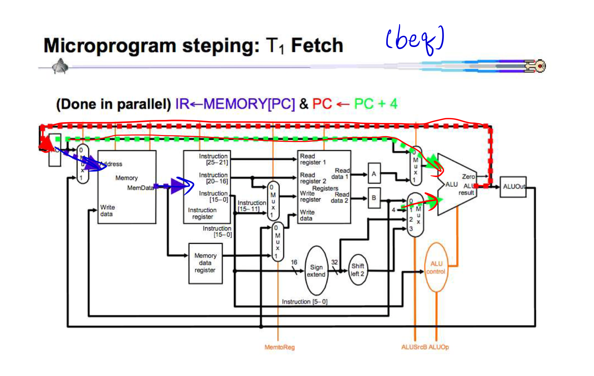
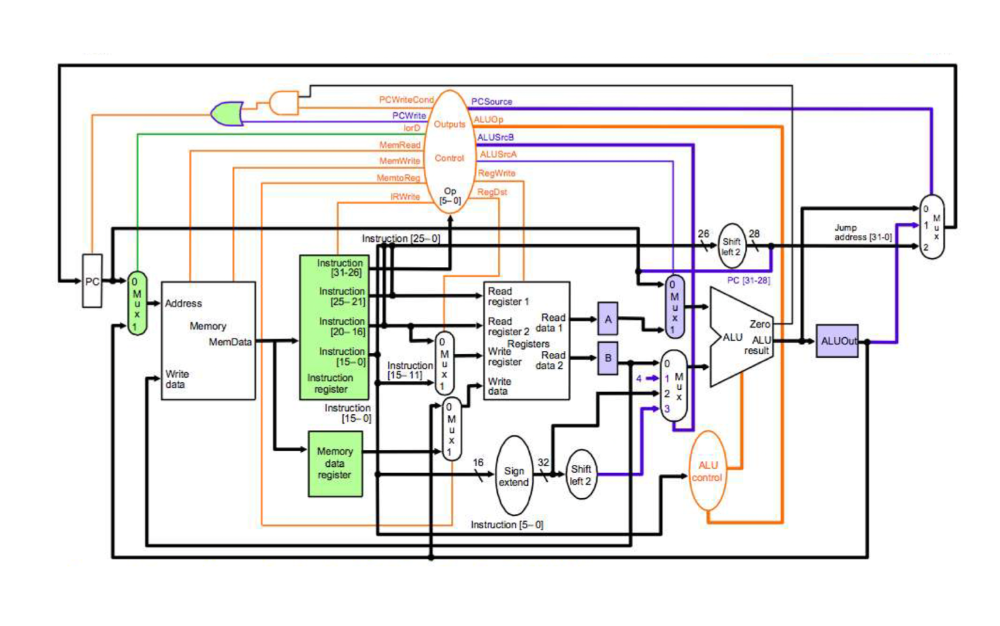
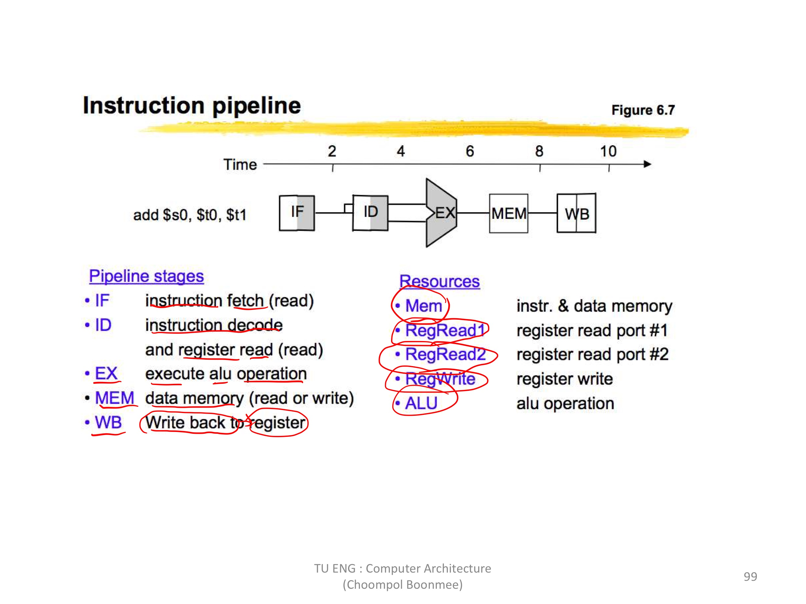

# รายงานวิชา CN210

## สรุปเนื้อหาวิชา

### สรุปเนื้อหา
วิชาสถาปัตยกรรมคอมพิวเตอร์

#### ส่งการบ้านครั้งที่ 1
  * 

  * [CLIP1(Youtube)](https://youtu.be/qxfaD4DFBt8)
    
  ** คำอธิบาย :
  
#### ส่งการบ้านครั้งที่ 2

  * 
  
  * [CLIP2(Youtube)](https://youtu.be/QzaD13TMT6o)
  
  ** คำอธิบาย :
  
#### ส่งการบ้านครั้งที่ 3

  * 
  
  * [CLIP3(Youtube)](https://youtu.be/hyol9zuLm_Q)
  
  ** คำอธิบาย :
  
#### ส่งการบ้านครั้งที่ 4

  * [CLIP4(Youtube)](https://youtu.be/hsoW6MwFPeI)
  
  
  
  ** คำอธิบาย :
  
#### ส่งการบ้านครั้งที่ 5

  * [CLIP5(Youtube)](https://youtu.be/LtYXk1vCkGU)
  
  
  
  ** คำอธิบาย :
  
#### ส่งการบ้านครั้งที่ 6

  * [CLIP6(Youtube)](https://youtu.be/pyeTy94TIKw)
  
  
  
  ** คำอธิบาย :
  
  #### ส่งการบ้านครั้งที่ 7
 
  
  
   * [CLIP7(Youtube)](https://youtu.be/YiI7OqvRDE0)
  
  ** คำอธิบาย : คลิปนี้จะอธิบายเกี่ยวกับ Pipelining ว่ามันคืออะไร มีองค์ประกอบอะไร ข้อดี ปัญหาของ Pipelining การทำงาน ความแตกต่างของการทำงาน
               โดย Pipelining เป็นหน่วยความจำที่อ่านคำสั่งต่างๆ ผ่านกระบวนการต่างๆ จนจบคำสั่งคล้าย Register แต่ต่างที่ Pipelining เก็บค่าได้มากกว่า Register 
               แต่ทำงานช้ากว่า Register โดย Pipelining จะสามารถทำคำสั่งได้มากกว่า 1 คำสั่งเพราะใช้หลักการแบบเมื่อกระบวนการทำงานทำงานคำสั่งก่อนหน้า จะ
               สามารถทำงานคำสั่งต่อไปได้ แต่มันมีปัญหาคือคำสั่งมีโอกาสทำกระบวนการเดียวกันเกิน 1 คำสั่ง หรือมีโอกาสที่จะผิดพลาดเมื่อคำสั่งหลังต้องการรับค่าจากคำสั่งก่อน
               หน้า แต่คำสั่งก่อนหน้ายังไม่เสร็จ ซึ่งวิธีแก้ปัญหามี 4 อย่างคือ Waiting Forwarding Load-Forwarding และ Reordering
